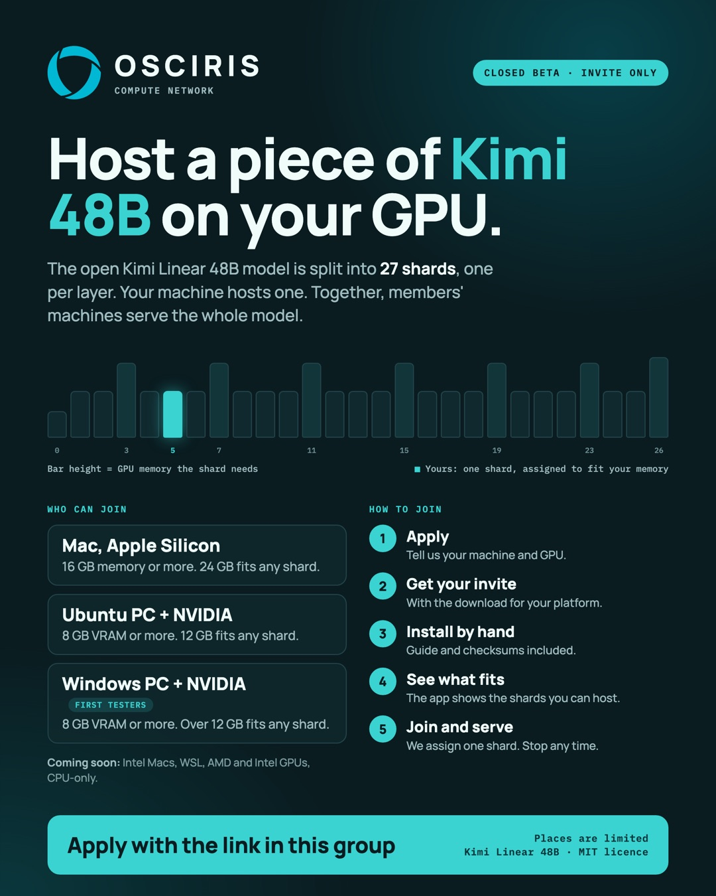

  <picture>
    <source media="(prefers-color-scheme: dark)" srcset="assets/osciris-logo-white.svg">
    
  </picture>

<h1 align="center">OSCIRIS Node</h1>

  The desktop app for joining the OSCIRIS compute network. 
  <a href="https://oscirislabs.com/beta/"><strong>Apply for the Kimi 48B GPU closed beta</strong></a> ·
  <a href="https://oscirislabs.com">oscirislabs.com</a> ·
  <a href="../../releases">Downloads</a>

---

OSCIRIS splits large open AI models into shards that everyday Macs and NVIDIA PCs can host, and runs them together as one model. Every step a machine performs comes back signed, so the work can be checked.

This repository is where OSCIRIS Node desktop releases and beta materials are published. The source code is not in this repository.

## Kimi 48B GPU closed beta

  

The open [Kimi Linear 48B](https://huggingface.co/moonshotai/Kimi-Linear-48B-A3B-Instruct) model (MIT licence) is split into 27 shards, one per layer. Each beta machine hosts one shard on its GPU, and together the machines serve the whole model. The beta is invite only.

### Who can join

| Machine | Memory | Shards it can host |
|---|---|---|
| Mac with Apple Silicon | 16–23 GB | 20 of 27 |
| Mac with Apple Silicon | 24 GB or more | All 27 |
| Ubuntu PC (x86_64) with an NVIDIA GPU | 8–11 GB VRAM | 20 of 27 |
| Ubuntu PC (x86_64) with an NVIDIA GPU | 12 GB VRAM or more | All 27 |
| Windows PC (x64) with an NVIDIA GPU, first testers | 8–12 GB VRAM | 20 of 27 |
| Windows PC (x64) with an NVIDIA GPU, first testers | More than 12 GB VRAM | All 27 |
| WSL 2, Linux ARM, Intel Mac, AMD or Intel GPU, CPU only | — | Coming soon |

Each figure comes from memory measured shard by shard on Apple Metal, and on NVIDIA CUDA on Ubuntu and on Windows, at 4,096 tokens of context. A Mac keeps 8 GB of its memory free for macOS, and a Windows PC keeps 1 GB of GPU memory free for the desktop. Each machine hosts exactly one shard.

### How joining works

1. **Apply** at [oscirislabs.com/beta](https://oscirislabs.com/beta/). The form shows how many shards your machine can host.
2. **Get your invite.** We invite in small rounds and send the download for your platform.
3. **Install by hand.** Follow the install guide and check each file's SHA-256 checksum.
4. **See what fits.** OSCIRIS Node shows which shards your machine can host.
5. **Join and serve.** We assign you one shard. The app downloads and verifies it, then serves it. You can stop at any time.

## Downloads

Latest: **[OSCIRIS Node 0.1.3](https://github.com/oscirisprotocol/osciris-node/releases/tag/v0.1.3)** (closed beta pre-release). All releases are on the [Releases page](../../releases).

| Platform | Installer |
|---|---|
| macOS (Apple Silicon) | [`OSCIRIS.Node_0.1.3_aarch64.dmg`](https://github.com/oscirisprotocol/osciris-node/releases/download/v0.1.3/OSCIRIS.Node_0.1.3_aarch64.dmg) |
| Windows (x64) | [`OSCIRIS.Node_0.1.3_x64-setup.exe`](https://github.com/oscirisprotocol/osciris-node/releases/download/v0.1.3/OSCIRIS.Node_0.1.3_x64-setup.exe) or [`.msi`](https://github.com/oscirisprotocol/osciris-node/releases/download/v0.1.3/OSCIRIS.Node_0.1.3_x64_en-US.msi) |
| Linux (x86_64, Ubuntu 22.04 or newer) | [`OSCIRIS.Node_0.1.3_amd64.AppImage`](https://github.com/oscirisprotocol/osciris-node/releases/download/v0.1.3/OSCIRIS.Node_0.1.3_amd64.AppImage) or [`.deb`](https://github.com/oscirisprotocol/osciris-node/releases/download/v0.1.3/OSCIRIS.Node_0.1.3_amd64.deb) |
| Intel Mac | Coming soon |

Every release includes `SHA256SUMS.txt` with the checksum of each file. Joining with a GPU opens to invited members in rounds.

### Installing a build that is not from an app store

Beta builds are not distributed through an app store, so your system may warn you the first time:

- **macOS:** if macOS says the app is from an unidentified developer, open **System Settings → Privacy & Security** and choose **Open Anyway**.
- **Windows:** if SmartScreen appears, choose **More info**, then **Run anyway**.

Check the checksum first. On macOS and Linux run `shasum -a 256 <file>`; on Windows run `Get-FileHash <file>` in PowerShell.

## Contact

- Beta applications: [oscirislabs.com/beta](https://oscirislabs.com/beta/)
- Questions and enterprise pilots: info@oscirislabs.com

Please don't send passwords, keys or private data. We never ask for them.

---

Copyright 2026 OSCIRIS Labs. The OSCIRIS name, logo and flier are trademarks or brand assets of OSCIRIS Labs. Kimi Linear 48B is published by Moonshot AI under the MIT licence.
